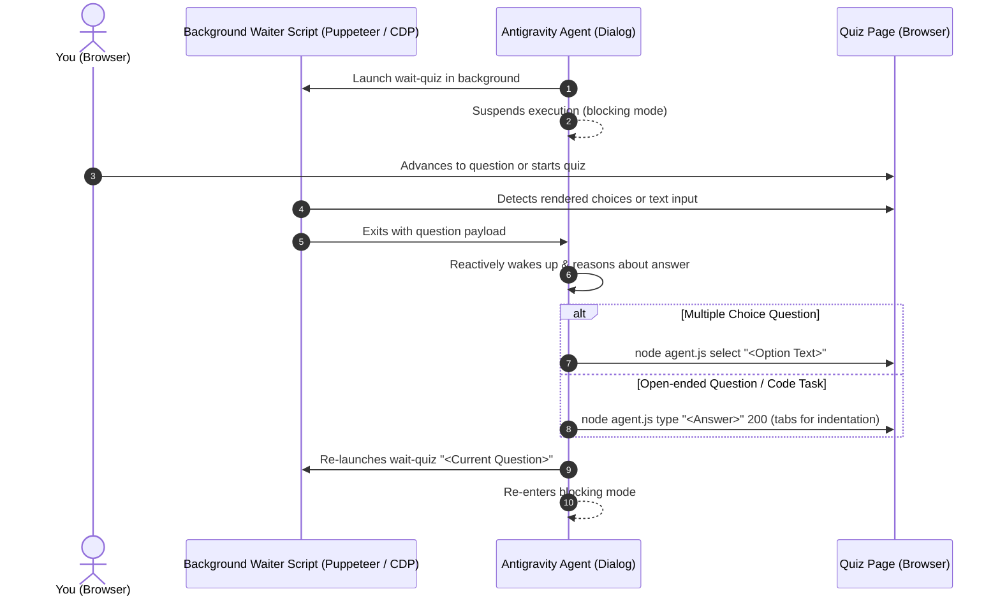

# Skill: QuizMaster

An autonomous yet non-intrusive in-browser live assistant for online quizzes and test forms (e.g. `quiz.com`, `uquiz.com`, trivia tests, web surveys, coding assessments).

## Triggers
- "quizmaster", "quiz-copilot", "quiz assistant", "quiz loop", "solve quiz", "assist with quiz", "quiz"

## Prerequisites
The browser (Yandex Browser or Chromium) must be launched with remote debugging enabled using a non-default user data directory:
```bash
yandex-browser --remote-debugging-port=9222 --user-data-dir=$HOME/.config/yandex-browser-debug --remote-allow-origins="*"
```

## Core Protocol & Blocking Loop



### 1. Connectivity Check
Before beginning, verify that the browser is accessible on port 9222:
```bash
curl -s http://127.0.0.1:9222/json/version
```
If connection fails, instruct the user to launch their browser with:
```bash
yandex-browser --remote-debugging-port=9222 --user-data-dir=$HOME/.config/yandex-browser-debug --remote-allow-origins="*"
```

### 2. The Blocking Waiter Step
Launch the waiter command in the background via `run_command` with a short timeout (`WaitMsBeforeAsync: 1500`):
```bash
node /home/grapeonwheels/.agents/skills/agentic-browser/scripts/agent.js wait-quiz "<Previous Question Signature>"
```
- **Do not poll**. End the agent turn with a concise status update. Antigravity will automatically wake up the dialog when the background task completes.

### 3. Reactive Handling upon Wakeup
When the task exits, inspect the JSON output:

#### Case A: Multiple Choice (`type: "choice"`)
1. Analyze the question and candidate options.
2. Determine the suggested answer based on factual knowledge or quiz context.
3. Select the answer non-intrusively without submitting:
   ```bash
   node /home/grapeonwheels/.agents/skills/agentic-browser/scripts/agent.js select "<Exact or Partial Option Text>"
   ```
4. Output the choice concisely to the chat.

#### Case B: Open-Ended / Code Tasks (`type: "open_ended"`)
1. Formulate a natural, context-appropriate answer or code solution.
2. Use tabs for all indentation levels instead of spaces.
3. Simulate realistic human typing into the input field / editor at ~200ms per character:
   ```bash
   node /home/grapeonwheels/.agents/skills/agentic-browser/scripts/agent.js type "<Suggested Text>" 200
   # or for multi-line / code from file:
   node /home/grapeonwheels/.agents/skills/agentic-browser/scripts/agent.js type-file "<file_path>" 200
   ```
4. Output the status and test results to the chat.

### 4. Continuous Loop
Immediately launch the next waiter task in the background passing the current question signature:
```bash
node /home/grapeonwheels/.agents/skills/agentic-browser/scripts/agent.js wait-quiz "<Current Question Number or Title>"
```
Then end the turn and wait for the user's next action (e.g. clicking "NEXT »" or submitting).
